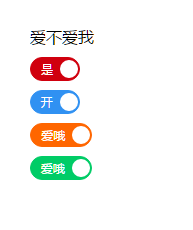
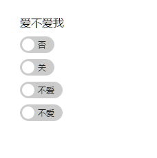

# vue-switch

vue触发器组件（开关）

## demo

示例（vue@1.0+） [点我](http://dai-siki.github.io/vue-switch/example/demo.html).

## 截图





## 依赖

基于 vue.js@1.0+ 版本。模块使用es6编写（需babel转译）。


## 安装

#### npm

```shell
$ npm install vue-switch
```

## 使用

#### 相关参数

| 名称              | 类型               | 默认             | 说明                                         |
| ----------------- | ----------------- | ---------------- | --------------------------------------------- |
| value             | bollean         | true            | 要绑定的变量    |
| open-name             | String            | "是"               | 激活时显示                   |
| colose-name            | String            | '否'     | 关闭时显示                                    |
| size           | String           | ""            | lg(显示两个汉字)              |
| color       | String            | "red"               | 颜色，可选：red/blue/orange/green                                     |


#### 示例(vue@1.0+)

```html

<div id="app">
	<label for="myDate">你爱不爱我？</label>
	<div class="wrap">
		<switch :value.sync="toggle"></switch>
	</div>
	<div class="wrap">
		<switch open-name="开" close-name="关" color="blue"
			 :value.sync="toggle"></switch>
	</div>
	<div class="wrap">
		<switch open-name="爱哦" close-name="不爱" size="lg" color="orange"
			 :value.sync="toggle"></switch>
	</div>
	<div class="wrap">
		<switch open-name="爱哦" close-name="不爱" size="lg" color="green"
			 :value.sync="toggle"></switch>
	</div>
</div>

<script>
import 'babel-polyfill'; //因为使用了es6的一些方法，需要babel垫片，如果你项目中已有相关兼容性方案，可忽略
import Vue from 'vue';
import mySwitch from 'vue-switch';

new Vue({
	el: '#app',
	data: {
		toggle: true
	},
	components: {
		'switch': mySwitch
	}
});

```
